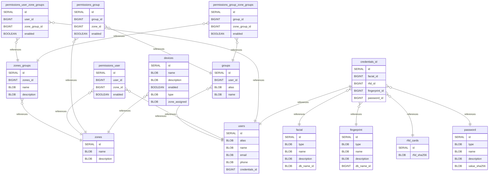

# Untitled Diagram documentation

https://www.drawdb.app/editor
https://dbdiagram.io/d/68a2000f1d75ee360aed166f

## Summary

- [Untitled Diagram documentation](#untitled-diagram-documentation)
	- [Summary](#summary)
	- [Introduction](#introduction)
	- [Database type](#database-type)
	- [Table structure](#table-structure)
		- [zones](#zones)
		- [zones\_groups](#zones_groups)
		- [users](#users)
		- [permissions\_user](#permissions_user)
		- [permissions\_user\_zone\_groups](#permissions_user_zone_groups)
		- [groups](#groups)
		- [permissions\_group](#permissions_group)
		- [permissions\_group\_zone\_groups](#permissions_group_zone_groups)
		- [credentials\_id](#credentials_id)
		- [facial](#facial)
		- [fingerprint](#fingerprint)
		- [password](#password)
		- [rfid\_cards](#rfid_cards)
		- [devices](#devices)
	- [Relationships](#relationships)
	- [Database Diagram](#database-diagram)

## Introduction

## Database type

- **Database system:** PostgreSQL
## Table structure

### zones

| Name            | Type   | Settings               | References | Note |
| --------------- | ------ | ---------------------- | ---------- | ---- |
| **id**          | SERIAL | 🔑 PK, not null, unique |            |      |
| **name**        | BLOB   | not null               |            |      |
| **description** | BLOB   | not null               |            |      |

### zones_groups

| Name            | Type   | Settings               | References                     | Note |
| --------------- | ------ | ---------------------- | ------------------------------ | ---- |
| **id**          | SERIAL | 🔑 PK, not null, unique |                                |      |
| **zones_id**    | BIGINT | not null               | fk_zones_groups_zones_id_zones |      |
| **name**        | BLOB   | not null               |                                |      |
| **description** | BLOB   | not null               |                                |      |

### users

| Name               | Type   | Settings               | References | Note |
| ------------------ | ------ | ---------------------- | ---------- | ---- |
| **id**             | SERIAL | 🔑 PK, not null, unique |            |      |
| **alias**          | BLOB   | not null               |            |      |
| **name**           | BLOB   | not null               |            |      |
| **email**          | BLOB   | null                   |            |      |
| **phone**          | BLOB   | null                   |            |      |
| **credentials_id** | BIGINT | null                   |            |      |

### permissions_user

| Name        | Type    | Settings               | References                        | Note |
| ----------- | ------- | ---------------------- | --------------------------------- | ---- |
| **id**      | SERIAL  | 🔑 PK, not null, unique |                                   |      |
| **user_id** | BIGINT  | null                   | fk_permissions_user_user_id_users |      |
| **zone_id** | BIGINT  | null                   | fk_permissions_user_zone_id_zones |      |
| **enabled** | BOOLEAN | null                   |                                   |      |

### permissions_user_zone_groups

| Name              | Type    | Settings               | References                                                 | Note |
| ----------------- | ------- | ---------------------- | ---------------------------------------------------------- | ---- |
| **id**            | SERIAL  | 🔑 PK, not null, unique |                                                            |      |
| **user_id**       | BIGINT  | null                   | fk_permissions_user_zone_groups_user_id_users              |      |
| **zone_group_id** | BIGINT  | null                   | fk_permissions_user_zone_groups_zone_group_id_zones_groups |      |
| **enabled**       | BOOLEAN | null                   |                                                            |      |

### groups

| Name        | Type   | Settings               | References              | Note |
| ----------- | ------ | ---------------------- | ----------------------- | ---- |
| **id**      | SERIAL | 🔑 PK, not null, unique |                         |      |
| **user_id** | BIGINT | null                   | fk_groups_user_id_users |      |
| **alias**   | BLOB   | not null               |                         |      |
| **name**    | BLOB   | not null               |                         |      |

### permissions_group

| Name         | Type    | Settings               | References                           | Note |
| ------------ | ------- | ---------------------- | ------------------------------------ | ---- |
| **id**       | SERIAL  | 🔑 PK, not null, unique |                                      |      |
| **group_id** | BIGINT  | null                   | fk_permissions_group_group_id_groups |      |
| **zone_id**  | BIGINT  | null                   | fk_permissions_group_zone_id_zones   |      |
| **enabled**  | BOOLEAN | null                   |                                      |      |

### permissions_group_zone_groups

| Name              | Type    | Settings               | References                                                                                                        | Note |
| ----------------- | ------- | ---------------------- | ----------------------------------------------------------------------------------------------------------------- | ---- |
| **id**            | SERIAL  | 🔑 PK, not null, unique |                                                                                                                   |      |
| **group_id**      | BIGINT  | null                   |                                                                                                                   |      |
| **zone_group_id** | BIGINT  | null                   | fk_permissions_group_zone_groups_zone_group_id_zones_groups,fk_permissions_group_zone_groups_zone_group_id_groups |      |
| **enabled**       | BOOLEAN | null                   |                                                                                                                   |      |

### credentials_id

| Name               | Type   | Settings               | References                                   | Note |
| ------------------ | ------ | ---------------------- | -------------------------------------------- | ---- |
| **id**             | SERIAL | 🔑 PK, not null, unique | fk_credentials_id_id_users                   |      |
| **facial_id**      | BIGINT | null                   | fk_credentials_id_facial_id_facial           |      |
| **rfid_id**        | BIGINT | null                   | fk_credentials_id_rfid_id_rfid_cards         |      |
| **fingerprint_id** | BIGINT | null                   | fk_credentials_id_fingerprint_id_fingerprint |      |
| **password_id**    | BIGINT | null                   | fk_credentials_id_password_id_password       |      |

### facial

| Name            | Type   | Settings               | References | Note |
| --------------- | ------ | ---------------------- | ---------- | ---- |
| **id**          | SERIAL | 🔑 PK, not null, unique |            |      |
| **type**        | BLOB   | not null               |            |      |
| **name**        | BLOB   | not null               |            |      |
| **description** | BLOB   | null                   |            |      |
| **db_name_id**  | BLOB   | not null               |            |      |

### fingerprint

| Name            | Type   | Settings               | References | Note |
| --------------- | ------ | ---------------------- | ---------- | ---- |
| **id**          | SERIAL | 🔑 PK, not null, unique |            |      |
| **type**        | BLOB   | not null               |            |      |
| **name**        | BLOB   | not null               |            |      |
| **description** | BLOB   | null                   |            |      |
| **db_name_id**  | BIGINT | not null               |            |      |

### password

| Name             | Type   | Settings               | References | Note |
| ---------------- | ------ | ---------------------- | ---------- | ---- |
| **id**           | SERIAL | 🔑 PK, not null, unique |            |      |
| **type**         | BLOB   | not null               |            |      |
| **name**         | BLOB   | not null               |            |      |
| **description**  | BLOB   | null                   |            |      |
| **value_sha256** | BLOB   | not null               |            |      |

### rfid_cards

| Name            | Type   | Settings               | References | Note |
| --------------- | ------ | ---------------------- | ---------- | ---- |
| **id**          | SERIAL | 🔑 PK, not null, unique |            |      |
| **rfid_sha256** | BLOB   | not null               |            |      |

### devices

| Name              | Type    | Settings               | References                     | Note |
| ----------------- | ------- | ---------------------- | ------------------------------ | ---- |
| **id**            | SERIAL  | 🔑 PK, not null, unique |                                |      |
| **name**          | BLOB    | not null               |                                |      |
| **description**   | BLOB    | not null               |                                |      |
| **enabled**       | BOOLEAN | not null               |                                |      |
| **type**          | BLOB    | not null               |                                |      |
| **zone_assigned** | BLOB    | not null               | fk_devices_zone_assigned_zones |      |

## Relationships

- **zones_groups to zones**: many_to_one
- **groups to users**: many_to_one
- **permissions_user to users**: many_to_one
- **permissions_user to zones**: many_to_one
- **permissions_user_zone_groups to zones_groups**: many_to_one
- **permissions_user_zone_groups to users**: many_to_one
- **permissions_group to groups**: many_to_one
- **permissions_group to zones**: many_to_one
- **permissions_group_zone_groups to zones_groups**: many_to_one
- **permissions_group_zone_groups to groups**: many_to_one
- **credentials_id to users**: one_to_one
- **credentials_id to facial**: many_to_one
- **credentials_id to fingerprint**: many_to_one
- **credentials_id to rfid_cards**: many_to_one
- **credentials_id to password**: many_to_one
- **devices to zones**: many_to_one

## Database Diagram

